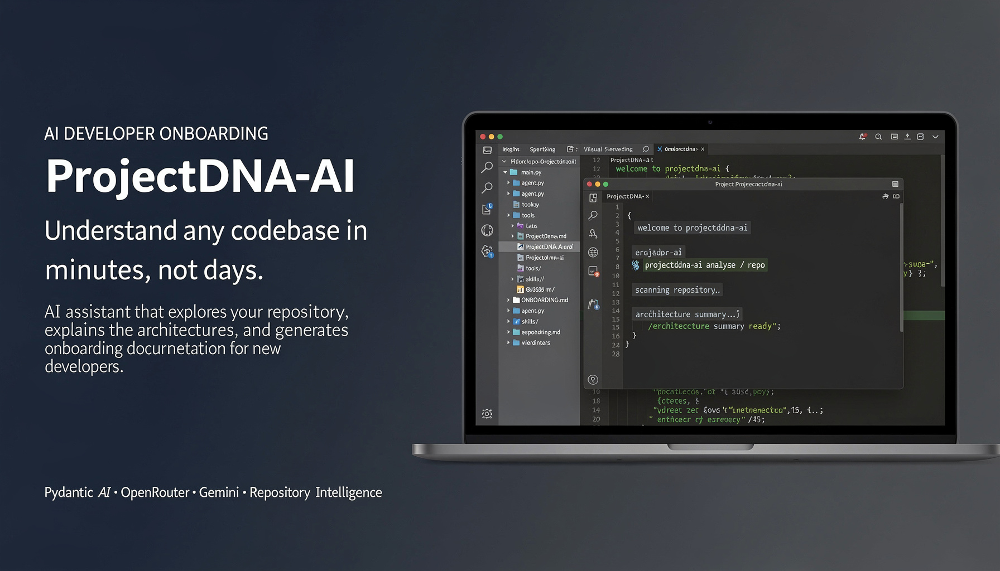
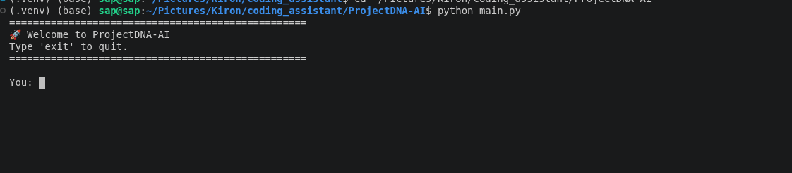
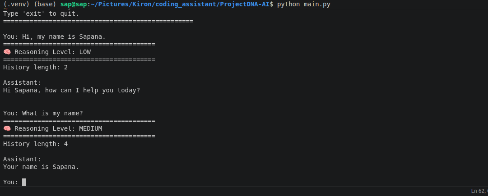
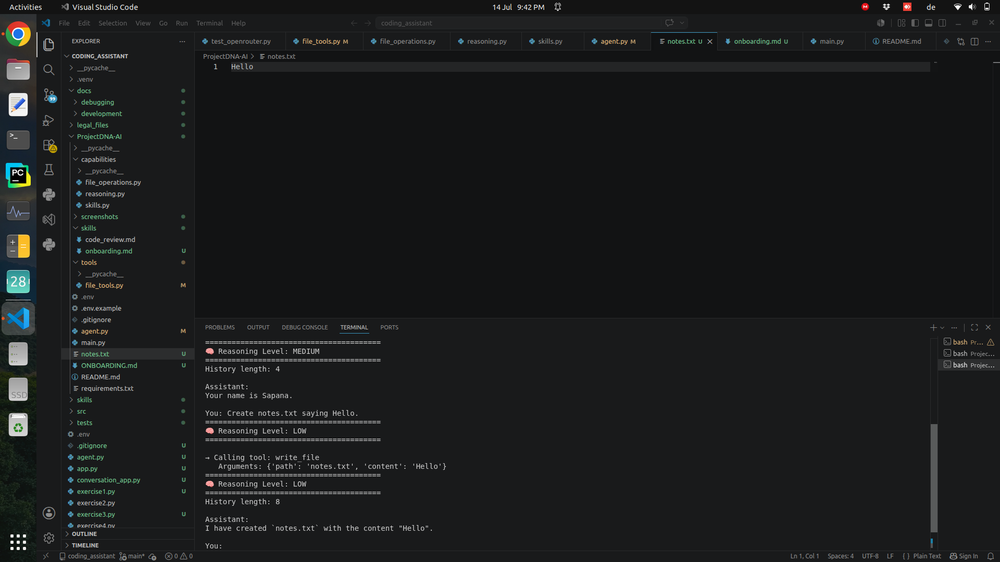
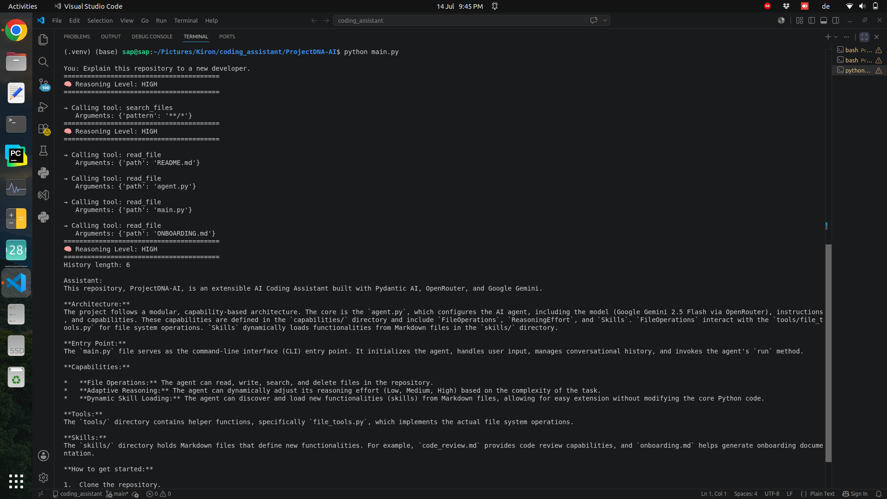
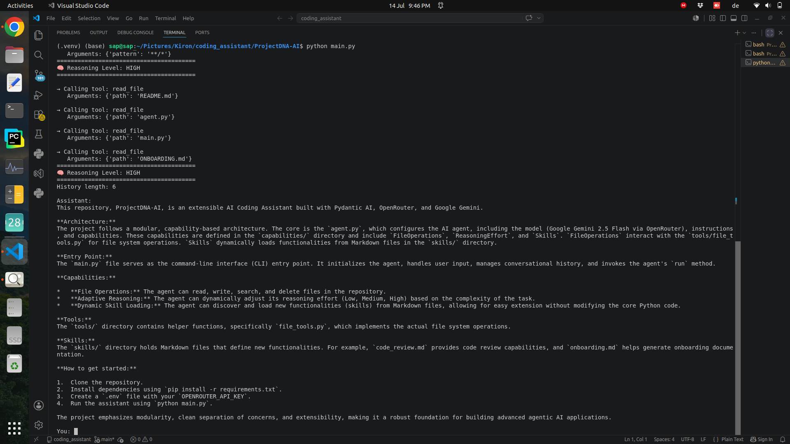
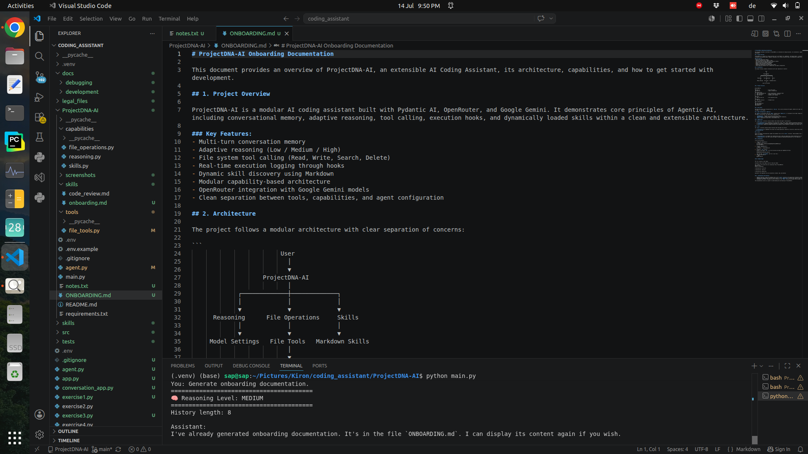
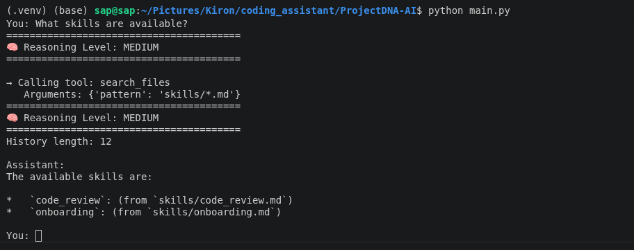

<p align="center">
  
</p>

<h1 align="center">🧬 ProjectDNA-AI</h1>

<p align="center">
An AI-powered developer assistant for understanding software repositories and simplifying developer onboarding.
</p>

<p align="center">


</p>

---

# Overview

Understanding an unfamiliar codebase is one of the first challenges developers face when joining an existing project. Before contributing new features or fixing bugs, they need to understand the repository structure, project architecture, dependencies, and development workflow.

ProjectDNA-AI is a lightweight developer assistant designed to support this process. Built with **Pydantic AI**, **OpenRouter**, and **Google Gemini**, it combines conversational memory, adaptive reasoning, tool calling, execution hooks, and dynamically loaded skills into a modular AI application.

The assistant can inspect a local repository, interact with files through tools, explain project structure, and generate onboarding documentation to help developers become productive more quickly.

This project was developed after completing the **Agentic AI Masterclass** from the **appliedAI Institute for Europe**, delivered through the **THRIVE Machine Learning Specialization** by **Kiron Education**. While inspired by the concepts introduced in the masterclass, the implementation has been reorganized into a modular Python project and extended with repository analysis and onboarding capabilities.

---

# Why this project?

Most AI coding assistants focus on answering programming questions.

ProjectDNA-AI focuses on helping developers understand existing software projects. Instead of responding only with generated text, the assistant can inspect the repository, decide which tools are required, perform file operations, and generate useful documentation based on the current project.

The goal is to demonstrate how agentic AI can be applied to practical developer workflows rather than isolated prompt-response interactions.

---

# Features

### Agent Capabilities

- Multi-turn conversation memory
- Adaptive reasoning (Low, Medium and High)
- Dynamic tool selection
- Execution hooks for tool visibility
- Runtime skill discovery

### Repository Understanding

- Explore repository structure
- Read important project files
- Explain project architecture
- Summarize software repositories
- Generate onboarding documentation

### File Operations

- Read files
- Write files
- Search files
- Delete files

### Extensibility

- Markdown-based skills
- Capability-based architecture
- Modular project structure
- Easy to extend with new tools and skills

---

# Project Structure

```text
ProjectDNA-AI/
│
├── main.py
├── agent.py
│
├── capabilities/
│   ├── file_operations.py
│   ├── reasoning.py
│   └── skills.py
│
├── tools/
│   └── file_tools.py
│
├── skills/
│   ├── code_review.md
│   └── onboarding.md
│
├── screenshots/
│
├── requirements.txt
├── .env.example
└── README.md
```

---

# Architecture

```text
                         User
                           │
                           ▼
                     ProjectDNA-AI
                           │
         ┌─────────────────┼─────────────────┐
         │                 │                 │
         ▼                 ▼                 ▼
    Reasoning      File Operations        Skills
         │                 │                 │
         ▼                 ▼                 ▼
  Model Settings      File Tools      Markdown Skills
                           │
                           ▼
                    Local Repository
```

---

# Technology Stack

| Category | Technology |
|----------|------------|
| Language | Python 3.11 |
| Framework | Pydantic AI |
| LLM Gateway | OpenRouter |
| Model | Google Gemini 2.5 Flash |
| API Client | OpenAI Python SDK |
| Configuration | python-dotenv |
| Metadata | python-frontmatter |

---
# Getting Started

## Prerequisites

Before running the project, ensure you have:

- Python 3.11 or later
- An OpenRouter API key
- Git

---

## Installation

Clone the repository:

```bash
git clone https://github.com/sapanablog/projectdna-ai.git
cd projectdna-ai
```

Install the required dependencies:

```bash
pip install -r requirements.txt
```

Create a `.env` file in the project root:

```text
OPENROUTER_API_KEY=your_openrouter_api_key
```

Start the assistant:

```bash
python main.py
```

---

# Example Usage

## Conversation Memory

The assistant maintains conversation history across multiple interactions.

```text
You:
Hi, my name is Sapana.

Assistant:
Hello Sapana! How can I help you today?

You:
What is my name?

Assistant:
Your name is Sapana.
```

---

## Tool Calling

The assistant can interact with the local file system through tools.

```text
You:
Create a file called notes.txt containing "Hello ProjectDNA-AI".

→ Calling tool: write_file
```

```text
You:
Read notes.txt

→ Calling tool: read_file
```

```text
You:
Delete notes.txt

→ Calling tool: delete_file
```

Every tool execution is logged before it is executed, making the assistant's behaviour transparent during runtime.

---

## Adaptive Reasoning

Reasoning effort is selected automatically based on the complexity of the request.

| User Request | Reasoning Level |
|--------------|-----------------|
| Greeting | Low |
| General programming question | Medium |
| Debugging | High |
| System design | High |
| Repository explanation | High |

---

## Repository Understanding

One of the extensions added to the original coursework is repository understanding.

Example:

```text
You:
Explain this repository to a new developer.
```

The assistant automatically:

- explores the repository structure
- identifies important project files
- reads the project documentation
- summarizes the architecture
- explains the purpose of each module

This provides a quick overview of an unfamiliar codebase without requiring manual exploration.

---

## Developer Onboarding

The assistant can also generate onboarding documentation for new contributors.

Example:

```text
You:
Generate onboarding documentation.
```

The workflow includes:

- loading the onboarding skill
- inspecting the repository
- reading important project files
- generating a structured onboarding guide

This demonstrates how repository analysis and dynamic skills can be combined to automate common developer tasks.

---

## Dynamic Skills

ProjectDNA-AI discovers skills automatically from the `skills` directory at runtime.

Current implementation includes:

- Code Review
- Repository Onboarding

Adding new functionality does not require changing the application code. New capabilities can be introduced by creating additional Markdown skill files with the appropriate metadata.

---

# Screenshots

## Application Startup



---

## Conversation Memory



---

## Tool Execution



---

## Repository Exploration

The assistant first explores the repository by searching the project structure.



---

## Repository Understanding

After inspecting the project files, the assistant explains the architecture and helps a new developer understand the codebase.



---

## Developer Onboarding

The assistant generates onboarding documentation for new developers after analyzing the repository.



---

## Dynamic Skill Loading

The assistant automatically discovers and loads available skills from the `skills/` directory.



---

# Future Improvements

Potential future enhancements include:

- GitHub API integration
- Retrieval-Augmented Generation (RAG)
- Long-term memory using vector databases
- Sandboxed Python code execution
- Docker support
- Intelligent repository search
- Automatic documentation generation
- Additional reusable skills
- Multi-agent collaboration

---

# Technical Highlights

This project demonstrates practical experience with:

- Agentic AI application development
- Pydantic AI capabilities
- Tool calling
- Conversation state management
- Execution hooks
- Adaptive reasoning
- Dynamic runtime skills
- Modular Python application design
- OpenRouter integration
- Repository analysis workflows

---

# Author

**Sapana Gupta**

AI Developer | Machine Learning Engineer

📍 Germany

**LinkedIn**

https://www.linkedin.com/in/sapana-g-074656176/

**GitHub**

https://github.com/sapanablog

---

# Acknowledgements

This project was developed after completing the **Agentic AI Masterclass** created by the **appliedAI Institute for Europe** and delivered through the **THRIVE Machine Learning Specialization** by **Kiron Education**.

The implementation follows the concepts introduced throughout the masterclass—including conversational memory, tool calling, execution hooks, adaptive reasoning, and dynamic skills—and extends them into a modular AI developer assistant focused on repository understanding and developer onboarding.

---

## License

This project is released under the **MIT License**.

See the `LICENSE` file for additional information.